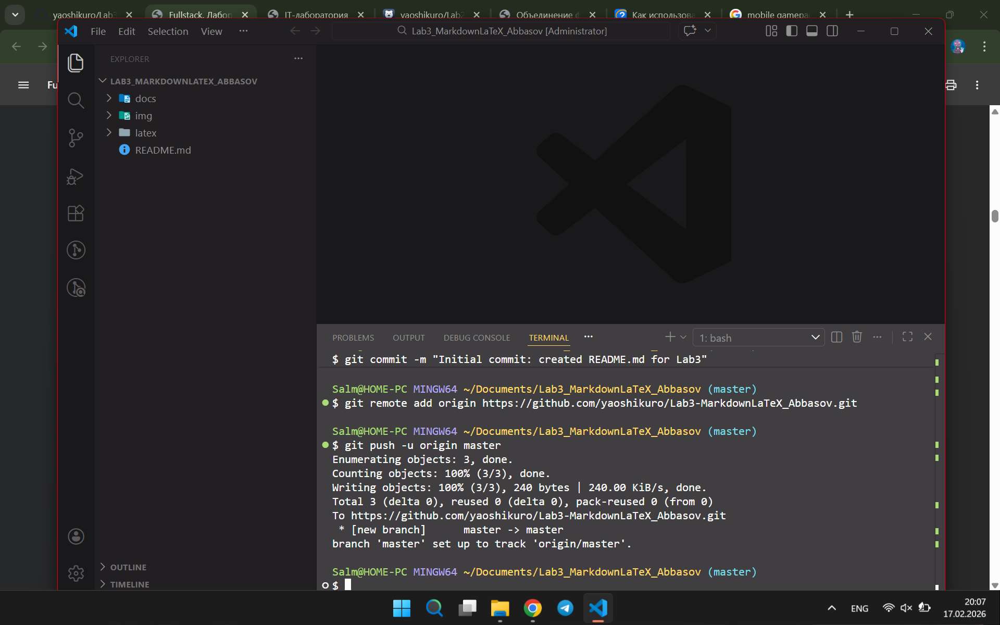

# Работа с Markdown-разметкой и базовое использование LaTeX в документации проекта
в этой лабораторной рабботе мы научились пользоваться базовыми разметками и базовому использованию LaTeX, для дальнейшего изучения фронтенд разработки

### Структура проекта
- списки
- вложенные списки

# 1. Заголовки
# h1
## h2
### h3

# 2. Горизонтальная линия
---
# 3. Форматирование текста
**полужирный текст**
*курсивный текст*
***полужирный курсив***
~~зачёркнутый текст~~
`моноширный текст`
# 4. Списки
- Первый пункт
- Второй пункт
- Третий пункт

1. Первый пункт
2. Второй пункт
3. Третий пункт

- Пункт первый
  - Подпункт 1
  - Подпункт 2
    - Еще глубже
    - И еще
# 5. Цитата
> волк не лев, но в цирке не выступает
# 6. Блок кода
```python
print(hello world)
```
# 7. Таблица
|эщкере|тик ток|брэинрот|
|------|-------|--------|
|круто|да|не хайп|
# 8. Изображение из папки img/

# 9. Ссылка
[gogole](https://google.com)
[ссылка на ссылку](linksImagesLab3_Abbasov.md)
# 10. Чекбоксы
## Задачи
- [ ] Невыполненная задача
- [x] Выполненная задача (с галочкой)
# 11. Сноска
В стиле GitHub
Текст[^1]
[^1]: эщкереееъ
# 12. Alert-блоки GitHub
>[!NOTE]
>заметка

>[!TIP]
>совет

>[!WARNING]
>опасно!!

# 13. Inline LaTeX
Пример:
Площадь круга: $S = \pi r^2
# 14. Block LaTeX
Пример:
$$
\sum_{i=1}^n i = \frac{n(n+1)}{2}
$$